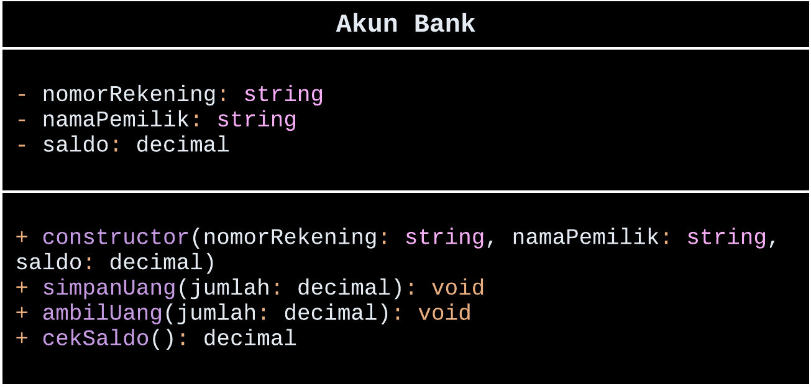
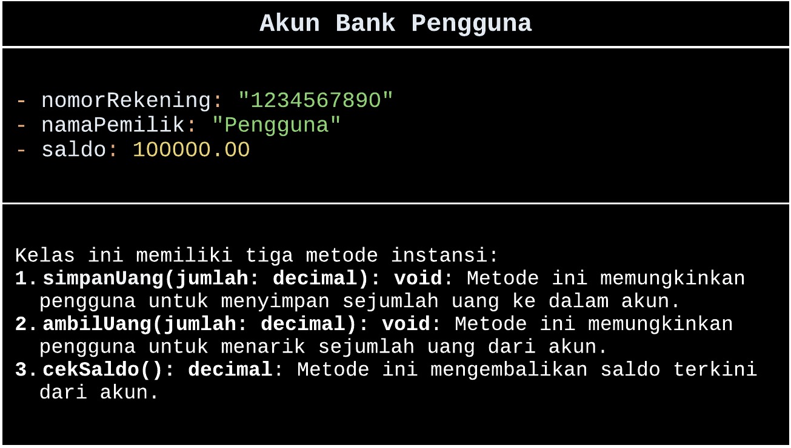
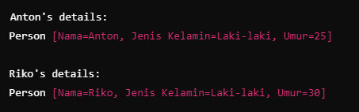
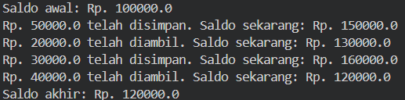

# POO_Latihan2
Nama: Wishnu Aqbil Ramadani Kelas: TI.23.A6

Jawaban!

Latihan 1

Apa yang harus didefinisikan sebelum membuat objek?

> Sebelum membuat objek, kita perlu mendefinisikan sebuah class sebagai rancangan atau blueprint dari objek yang akan kita buat.

Buatlah gambar diagram class dan dua buah objek dari class Person bernama Antor dan Riko!

> Class Diagram

> Object Instances

>     
 
Buatlah gambar diagram objek AkunBank dengan instance method simpan Uang, ambilUang dan cekSaldo!

> Class Diagram

> Object Instances

Latihan 2

Buatlah kode program java untuk:

Mendeklarasikan class Person, dengan atribut Nama,JenisKelamin, Umur
Buatlah dua buah objek dari class Person bernama Anton dan Riko

package Person;

public class Person {
    private String nama;
    private String jenisKelamin;
    private int umur;

    // Constructor
    public Person(String nama, String jenisKelamin, int umur) {
        this.nama = nama;
        this.jenisKelamin = jenisKelamin;
        this.umur = umur;
    }

    // Getters and Setters
    public String getNama() {
        return nama;
    }

    public void setNama(String nama) {
        this.nama = nama;
    }

    public String getJenisKelamin() {
        return jenisKelamin;
    }

    public void setJenisKelamin(String jenisKelamin) {
        this.jenisKelamin = jenisKelamin;
    }

    public int getUmur() {
        return umur;
    }

    public void setUmur(int umur) {
        this.umur = umur;
    }

    // toString method to return a proper string representation of the object
    @Override
    public String toString() {
        return "Person [Nama=" + nama + ", Jenis Kelamin=" + jenisKelamin + ", Umur=" + umur + "]";
    }

    public static void main(String[] args) {
        // Create two objects from the Person class
        Person Anton = new Person("Anton", "Laki-laki", 25);
        Person Riko = new Person("Riko", "Laki-laki", 30);

        // Print the attributes of each object
        System.out.println("Anton's details:");
        System.out.println(Anton); // Automatically calls Anton's toString method

        System.out.println("\nRiko's details:");
        System.out.println(Riko); // Automatically calls Riko's toString method
    }
}

OUTPUT

Latihan 3

Buatlah kode java untuk:

Mendeklarasikan class AkunBank dengan instance method simpanUang, ambilUang dan cekSaldo
Buat objek AkunBank dan tetapkan nilai saldo awal Rp. 100000, kemudian panggil 3 method tersebut dan tampilkan proses

public class AkunBank {
    private String nomorRekening;
    private String namaPemilik;
    private double saldo;

    // Constructor
    public AkunBank(String nomorRekening, String namaPemilik, double saldo) {
        this.nomorRekening = nomorRekening;
        this.namaPemilik = namaPemilik;
        this.saldo = saldo;
    }

    // Instance methods
    public void simpanUang(double jumlah) {
        this.saldo += jumlah;
        System.out.println("Rp. " + jumlah + " telah disimpan. Saldo sekarang: Rp. " + this.saldo);
    }

    public void ambilUang(double jumlah) {
        if (jumlah > this.saldo) {
            System.out.println("Saldo tidak cukup untuk mengambil Rp. " + jumlah);
        } else {
            this.saldo -= jumlah;
            System.out.println("Rp. " + jumlah + " telah diambil. Saldo sekarang: Rp. " + this.saldo);
        }
    }

    public double cekSaldo() {
        return this.saldo;
    }

    public static void main(String[] args) {
        // Create an AkunBank object with initial balance of Rp. 100000
        AkunBank akun = new AkunBank("1234567890", "Antor", 100000);

        System.out.println("Saldo awal: Rp. " + akun.cekSaldo());

        // Call the instance methods
        akun.simpanUang(50000);
        akun.ambilUang(20000);
        akun.simpanUang(30000);
        akun.ambilUang(40000);

        System.out.println("Saldo akhir: Rp. " + akun.cekSaldo());
    }
}

OUTPUT

