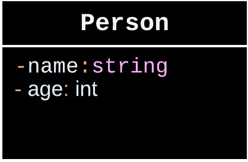
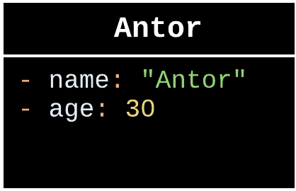
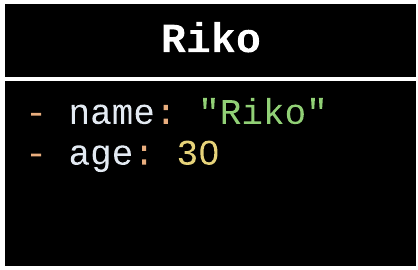

# POO_Latihan2
Nama:Wishnu Aqbil Ramadani Kelas: TI.23.A6

Jawaban!

Latihan1
Apa yang harus didefinisikan sebelum membuat objek?

> Sebelum membuat objek, kita perlu mendefinisikan sebuah class sebagai rancangan atau blueprint dari objek yang akan kita buat.

Buatlah gambar diagram class dan dua buah objek dari class Person bernama Antor dan Riko!

> Class Diagram                    > Object Instances
              

 
